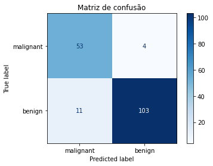

# Projeto Módulo 4: Cálculo de Métricas de Avaliação de Aprendizado

## Neste projeto, vamos calcular as principais métricas para avaliação de modelos de classificação de dados, como acurácia, sensibilidade (recall), especificidade, precisão e F-score. Para que seja possível implementar estas funções, você deve utilizar os métodos e suas fórmulas correspondentes (Tabela 1).

## Para a leitura dos valores de VP, VN, FP e FN, será necessário escolher uma matriz de confusão para a base dos cálculos. Essa matriz você pode escolher de forma arbitraria, pois nosso objetivo é entender como funciona cada métrica.


Para esse projeto de exemplo, vou utilizar um modelo de classificação para prever se uma amostra de tecido é benigna(classe 1) ou maligna(classe 0). 
O conjunto de dados Breast Cancer Wisconsin é uma base de dados amplamente utilizada para problemas de classificação relacionados ao diagnóstico de câncer de mama. 

O conjunto de dados consiste em 569 amostras de tecido mamário, com 30 características diferentes para cada amostra. Além das características, o conjunto também fornece as classes reais associadas a cada amostra, indicando se é benigna ou maligna.

## Carregando as bibliotecas:


```python
import numpy as np
import pandas as pd
import matplotlib.pyplot as plt
import seaborn as sns
from sklearn.datasets import load_breast_cancer
from sklearn.model_selection import train_test_split
from sklearn.linear_model import LogisticRegression
from sklearn.tree import DecisionTreeClassifier
from sklearn.metrics import confusion_matrix, accuracy_score, precision_score, recall_score, f1_score
```

## Carregando o Dataset:


```python
# Carregar o dataset
data = load_breast_cancer()
```


```python
list(data.target_names)
```


    ['malignant', 'benign']


```python
# Criar o DataFrame
df = pd.DataFrame(data.data, columns=data.feature_names)

# Adicionar a coluna alvo (classe) ao DataFrame
df['target'] = data.target #classes

# Exibir as primeiras linhas do DataFrame
df.head()
```


<div>
<style scoped>
    .dataframe tbody tr th:only-of-type {
        vertical-align: middle;
    }

    .dataframe tbody tr th {
        vertical-align: top;
    }

    .dataframe thead th {
        text-align: right;
    }
</style>
<table border="1" class="dataframe">
  <thead>
    <tr style="text-align: right;">
      <th></th>
      <th>mean radius</th>
      <th>mean texture</th>
      <th>mean perimeter</th>
      <th>mean area</th>
      <th>mean smoothness</th>
      <th>mean compactness</th>
      <th>mean concavity</th>
      <th>mean concave points</th>
      <th>mean symmetry</th>
      <th>mean fractal dimension</th>
      <th>...</th>
      <th>worst texture</th>
      <th>worst perimeter</th>
      <th>worst area</th>
      <th>worst smoothness</th>
      <th>worst compactness</th>
      <th>worst concavity</th>
      <th>worst concave points</th>
      <th>worst symmetry</th>
      <th>worst fractal dimension</th>
      <th>target</th>
    </tr>
  </thead>
  <tbody>
    <tr>
      <th>0</th>
      <td>17.99</td>
      <td>10.38</td>
      <td>122.80</td>
      <td>1001.0</td>
      <td>0.11840</td>
      <td>0.27760</td>
      <td>0.3001</td>
      <td>0.14710</td>
      <td>0.2419</td>
      <td>0.07871</td>
      <td>...</td>
      <td>17.33</td>
      <td>184.60</td>
      <td>2019.0</td>
      <td>0.1622</td>
      <td>0.6656</td>
      <td>0.7119</td>
      <td>0.2654</td>
      <td>0.4601</td>
      <td>0.11890</td>
      <td>0</td>
    </tr>
    <tr>
      <th>1</th>
      <td>20.57</td>
      <td>17.77</td>
      <td>132.90</td>
      <td>1326.0</td>
      <td>0.08474</td>
      <td>0.07864</td>
      <td>0.0869</td>
      <td>0.07017</td>
      <td>0.1812</td>
      <td>0.05667</td>
      <td>...</td>
      <td>23.41</td>
      <td>158.80</td>
      <td>1956.0</td>
      <td>0.1238</td>
      <td>0.1866</td>
      <td>0.2416</td>
      <td>0.1860</td>
      <td>0.2750</td>
      <td>0.08902</td>
      <td>0</td>
    </tr>
    <tr>
      <th>2</th>
      <td>19.69</td>
      <td>21.25</td>
      <td>130.00</td>
      <td>1203.0</td>
      <td>0.10960</td>
      <td>0.15990</td>
      <td>0.1974</td>
      <td>0.12790</td>
      <td>0.2069</td>
      <td>0.05999</td>
      <td>...</td>
      <td>25.53</td>
      <td>152.50</td>
      <td>1709.0</td>
      <td>0.1444</td>
      <td>0.4245</td>
      <td>0.4504</td>
      <td>0.2430</td>
      <td>0.3613</td>
      <td>0.08758</td>
      <td>0</td>
    </tr>
    <tr>
      <th>3</th>
      <td>11.42</td>
      <td>20.38</td>
      <td>77.58</td>
      <td>386.1</td>
      <td>0.14250</td>
      <td>0.28390</td>
      <td>0.2414</td>
      <td>0.10520</td>
      <td>0.2597</td>
      <td>0.09744</td>
      <td>...</td>
      <td>26.50</td>
      <td>98.87</td>
      <td>567.7</td>
      <td>0.2098</td>
      <td>0.8663</td>
      <td>0.6869</td>
      <td>0.2575</td>
      <td>0.6638</td>
      <td>0.17300</td>
      <td>0</td>
    </tr>
    <tr>
      <th>4</th>
      <td>20.29</td>
      <td>14.34</td>
      <td>135.10</td>
      <td>1297.0</td>
      <td>0.10030</td>
      <td>0.13280</td>
      <td>0.1980</td>
      <td>0.10430</td>
      <td>0.1809</td>
      <td>0.05883</td>
      <td>...</td>
      <td>16.67</td>
      <td>152.20</td>
      <td>1575.0</td>
      <td>0.1374</td>
      <td>0.2050</td>
      <td>0.4000</td>
      <td>0.1625</td>
      <td>0.2364</td>
      <td>0.07678</td>
      <td>0</td>
    </tr>
  </tbody>
</table>
<p>5 rows × 31 columns</p>
</div>


**Plotando um gráfico para visualizar a distribuição das classes**.


```python
# Plotar o gráfico de barras com Seaborn
sns.countplot(x='target', data=df )

# Configurar os rótulos do eixo x e y
plt.xlabel('Classes')
plt.ylabel('Contagem')

# Definir o título do gráfico
plt.title('Contagem das Classes no Conjunto de Dados')

# Exibir o gráfico
plt.show()

```


    

    


## Dividindo o conjunto para Treino e Teste


```python
# Separando a target

X = df.drop('target',axis=1)

y = df.target

```


```python
# Dividir o dataset em conjunto de treinamento e teste
X_train, X_test, y_train, y_test = train_test_split(X, y, test_size=0.3, random_state=43)
```


```python
# Treinar o modelo de classificação
model = DecisionTreeClassifier(random_state=43)
model.fit(X_train, y_train)
```


    DecisionTreeClassifier(random_state=43)


```python
# Realizar a predição no conjunto de teste
y_pred = model.predict(X_test)
```


```python
# Calcular a matriz de confusão
cm = confusion_matrix(y_test, y_pred,)
```


```python
from sklearn.metrics import ConfusionMatrixDisplay
title = 'Matriz de confusão'
disp = ConfusionMatrixDisplay.from_estimator(
        model,
        X_test,
        y_test,
        display_labels=list(data.target_names),   #model.classes_,
        cmap=plt.cm.Blues,
        normalize=None,
    )
disp.ax_.set_title(title);
```


    

    


```python
vp = 53, vn = 103, fp = 11, fn = 4
```

### Criando uma função para realizar os cálculos:


```python
def calcular_metricas(vp, vn, fp, fn):
    # Calcular acurácia
    acuracia = (vp + vn) / (vp + vn + fp + fn)
    
    # Calcular sensibilidade (recall)
    sensibilidade = vp / (vp + fn)
    
    # Calcular especificidade
    especificidade = vn / (vn + fp)
    
    # Calcular precisão
    precisao = vp / (vp + fp)
    
    # Calcular F-score
    fscore = 2 * (precisao * sensibilidade) / (precisao + sensibilidade)
    
    # Retornar as métricas calculadas
    return acuracia, sensibilidade, especificidade, precisao, fscore
```

## Realizando o cálculo das métricas:


```python
vp = 53; vn = 103 ; fp = 11; fn = 4
```


```python
metricas = calcular_metricas(vp, vn, fp, fn)

# Imprimir as métricas
print("Acurácia:", metricas[0])
print("Sensibilidade (Recall):", metricas[1])
print("Especificidade:", metricas[2])
print("Precisão:", metricas[3])
print("F-score:", metricas[4])
```

    Acurácia: 0.9122807017543859
    Sensibilidade (Recall): 0.9298245614035088
    Especificidade: 0.9035087719298246
    Precisão: 0.828125
    F-score: 0.8760330578512396
    

## Conferindo com a biblioteca do sklearn.metrics:


```python
# Calcular as métricas de avaliação
accuracy = accuracy_score(y_test, y_pred)
precision = precision_score(y_test, y_pred, pos_label=0)
recall = recall_score(y_test, y_pred, pos_label=0)
f1 = f1_score(y_test, y_pred, pos_label=0)

# Exibir as métricas de avaliação
print(f'Acurácia: {accuracy}')
print(f'Sensibilidade (Recall): {recall}')
print(f'Precisão: {precision}')
print(f'F1-score: {f1}')
```

    Acurácia: 0.9122807017543859
    Sensibilidade (Recall): 0.9298245614035088
    Precisão: 0.828125
    F1-score: 0.8760330578512396
    

## Conclusão:

* **Acurácia:** A acurácia é uma medida de quão precisa é a classificação do modelo em geral. Ela representa a proporção de casos corretamente classificados em relação ao total de casos. No resultado fornecido (0.9122807017543859), a acurácia é de aproximadamente 91.23%, o que indica que o modelo classificou corretamente cerca de 91.23% dos casos.

* **Sensibilidade (Recall):** A sensibilidade, também conhecida como recall ou taxa de verdadeiros positivos, mede a proporção de casos positivos corretamente identificados pelo modelo em relação ao total de casos positivos. No resultado fornecido (0.9298245614035088), a sensibilidade é de aproximadamente 92.98%, o que indica que o modelo identificou corretamente cerca de 92.98% dos casos positivos(malignos).

* **Especificidade:** A especificidade mede a proporção de casos negativos corretamente identificados pelo modelo em relação ao total de casos negativos. No resultado fornecido (0.9035087719298246), a especificidade é de aproximadamente 90.35%, o que indica que o modelo identificou corretamente cerca de 90.35% dos casos negativos(benignos).

* **Precisão:** A precisão mede a proporção de casos positivos corretamente identificados em relação ao total de casos classificados como positivos pelo modelo. No resultado fornecido (0.828125), a precisão é de aproximadamente 82.81%, o que indica que, dos casos classificados como positivos pelo modelo, cerca de 82.81% foram corretamente identificados.

* **F-score:** O F-score é uma medida que combina a precisão e a sensibilidade do modelo em uma única métrica. Ele fornece uma medida de equilíbrio entre a precisão e a sensibilidade. No resultado fornecido (0.8760330578512396), o F-score é de aproximadamente 87.60%, indicando um bom equilíbrio entre a precisão e a sensibilidade do modelo.

**Essas métricas são usadas para avaliar a performance de modelos de classificação e fornecem informações sobre a qualidade das predições em diferentes aspectos, como a taxa de acertos, a capacidade de identificar corretamente casos positivos e negativos, a precisão na classificação dos casos positivos e o equilíbrio entre precisão e sensibilidade. É importante considerar todas essas métricas em conjunto para obter uma visão abrangente do desempenho do modelo.**


```python

```
